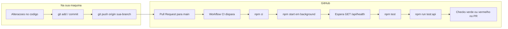

# CashFlow API

Estrutura inicial de uma API REST com JavaScript e Express, preparada para evoluir via user stories, com autenticação JWT, conexão MongoDB e documentação Swagger.

## Tecnologias

- Node.js + Express
- MongoDB + Mongoose
- JWT (`jsonwebtoken`)
- `bcryptjs` para hash de senha
- Swagger UI (`swagger-ui-express`)

## Estrutura de pastas

```txt
src/
  config/
  controllers/
  docs/
  middlewares/
  models/
  routes/
  services/
  app.js
  server.js
scripts/
  ci-full-flow.js
test/
  ct-cf4-001-login-valid-credentials.test.js
```

## Variaveis de ambiente

Copie `.env.example` para `.env` e ajuste os valores:

```bash
cp .env.example .env
```

Valores esperados:

- `NODE_ENV`
- `PORT`
- `BASE_URL`
- `MONGODB_URI`
- `JWT_SECRET`
- `JWT_EXPIRES_IN`

## Scripts

- `npm run start`: inicia a API de forma estatica.
- `npm run dev`: inicia com `nodemon` e reinicia automaticamente ao detectar alteracoes.
- `npm test`: executa testes unitarios (Jest).
- `npm run test:api`: executa testes de API automatizados (Mocha, Chai e Supertest) na pasta `test/`.
- `npm run ci:full`: sobe a API localmente, espera `/api/health`, roda `npm test` e `npm run test:api` (fluxo parecido com a CI).

## Como executar

1. Instale dependencias:

```bash
npm install
```

2. Configure o `.env`.
3. Suba o MongoDB localmente ou ajuste `MONGODB_URI`.
4. Execute:

```bash
npm run dev
```

## Endpoints iniciais

- `GET /api/health`
- `POST /api/auth/register`
- `POST /api/auth/login`
- `GET /api/auth/me` (protegido por Bearer Token)
- `GET /api/transactions` (protegido por Bearer Token — lista lancamentos do usuario, separados em `credito` e `debito`, com `totais`)
- `POST /api/transactions` (protegido por Bearer Token — cadastra lancamento `debito` ou `credito`)

Payload de exemplo para `POST /api/transactions`:

```json
{
  "tipo": "credito",
  "descricao": "Pagamento recebido",
  "valor": 150.5,
  "data_lancamento": "2026-05-05T12:00:00.000Z"
}
```

Regras principais:

- `tipo`: apenas `debito` ou `credito`.
- `valor`: numero maior que zero.
- `descricao` e `data_lancamento`: obrigatorios (`data_lancamento` em ISO 8601).

Resposta de exemplo para `GET /api/transactions` (ordem por `data_lancamento`, mais recente primeiro; sem dados vem arrays vazios e totais em zero):

```json
{
  "creditos": [
    {
      "id": "...",
      "tipo": "credito",
      "descricao": "Pagamento recebido",
      "valor": 150.5,
      "data_lancamento": "2026-05-05T12:00:00.000Z",
      "createdAt": "...",
      "updatedAt": "..."
    }
  ],
  "debitos": [],
  "totais": { "credito": 150.5, "debito": 0 }
}
```

## Swagger

Documentacao disponivel em:

- `GET /api-docs`

Especificacao OpenAPI em `src/docs/swagger.yaml`.

## Testes de API (Mocha + Chai + Supertest)

Cenarios de integracao ficam em `test/`. O caso **CT-CF4-001** (login com credenciais validas) cobre `POST /api/auth/login` conforme a especificacao OpenAPI: status `200`, corpo com `token` (JWT) e `user` sem expor a senha, e uso do token em `GET /api/auth/me`.

**Requisitos:** MongoDB acessivel e variaveis `MONGODB_URI` e `JWT_SECRET` definidas no `.env` (o proprio cenario registra um usuario exclusivo antes do login).

**Como rodar:**

```bash
npm install
npm run test:api
```

Para rodar apenas o CT-CF4-001:

```bash
npx mocha test/ct-cf4-001-login-valid-credentials.test.js
```

Configuracao global do Mocha: `.mocharc.json` (timeout e padrao de arquivos `test/**/*.test.js`).

## CI no GitHub (Actions)

A integracao continua esta definida em `.github/workflows/ci.yml`.

**Quando roda:** ao abrir ou atualizar um **pull request** com destino a branch **`main`**.

**O que o job faz (resumo):** contêiner Node 20, serviço MongoDB, `npm ci`, sobe a API com `npm start` em background, aguarda `GET /api/health`, executa `npm test` (Jest em `src/`) e `npm run test:api` (Mocha em `test/`).

**Como acompanhar no GitHub:**

1. Envie sua branch para o remoto (`git push origin <sua-branch>`).
2. Abra um pull request da sua branch para `main` (no GitHub: **Pull requests** → **New pull request**).
3. Na pagina do PR, a secao **Checks** mostra o workflow **CI**; voce tambem pode abrir a aba **Actions** do repositorio e selecionar a execucao correspondente ao PR para ver logs completos.

**Como disparar de novo:** qualquer novo `git push` na branch do PR reexecuta a pipeline automaticamente.

### Exemplo de fluxo completo (Git + CI + testes locais)

Visao geral do que acontece do commit ate o resultado da pipeline:



**Exemplo concreto de comandos Git (substitua a branch):**

```bash
git checkout -b feat/minha-alteracao
# ... edita arquivos ...
git add .
git commit -m "feat: descreva a mudanca"
git push -u origin feat/minha-alteracao
```

No site do GitHub: **Compare & pull request** → base `main` → abrir o PR. A execucao **CI** aparece em **Checks** e em **Actions**.

**Reproduzir o mesmo fluxo de testes no seu PC** (MongoDB e `.env` com `MONGODB_URI` e `JWT_SECRET`):

```bash
npm install
npm run ci:full
```

Esse script (`scripts/ci-full-flow.js`) sobe `node src/server.js`, espera `GET /api/health`, roda `npm test` e `npm run test:api`, depois encerra a API — equivalente ao que a CI faz apos o `npm ci`.

## Proximos passos sugeridos

- Expandir suite de testes de API para outros casos.
- Configurar lint/format.
- Preparar configuracao de deploy para Vercel.
